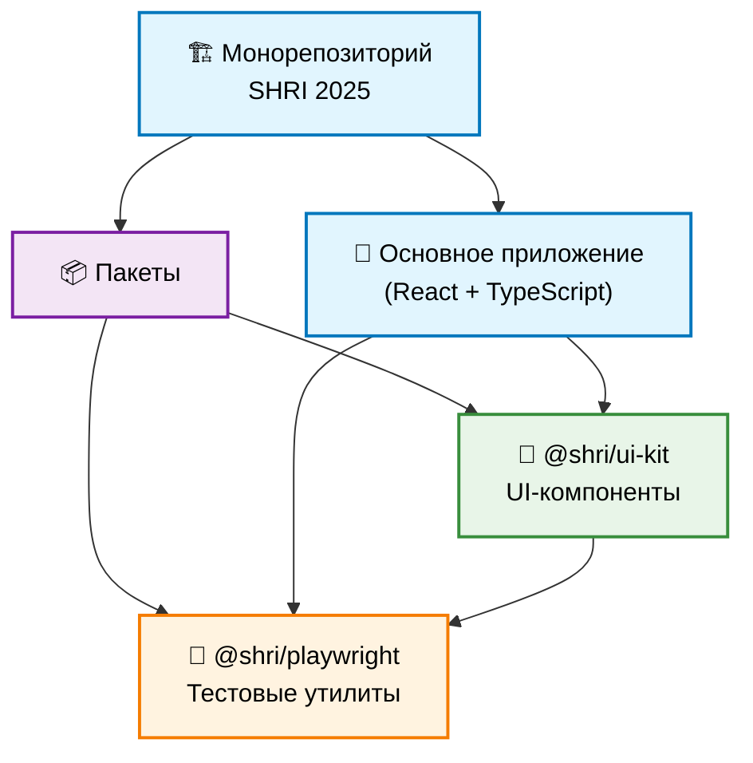

# Архитектура проекта

## Обзор

Проект построен по принципу **монорепозитория** с использованием `npm workspaces`. Эта архитектура разделяет основное приложение, переиспользуемую библиотеку UI-компонентов и утилиты для тестирования. Такой подход способствует лучшей модульности, переиспользованию кода и упрощению CI/CD процессов.

## Общая архитектура

## Детальная архитектура приложения

```mermaid
graph TD
    %% Основное приложение
    A["📱 Основное приложение"] --> B["🏠 Страницы"]
    A --> C["🧩 Компоненты"]
    A --> D["🏪 Управление состоянием"]
    A --> E["🌐 API слой"]
    A --> F["⚙️ Утилиты"]
    
    %% Страницы
    B --> B1["Home - Загрузка и анализ"]
    B --> B2["Generate - Генерация CSV файлов"]
    B --> B3["History - Просмотр истории"]
    
    %% Компоненты
    C --> C1["Layout компоненты"]
    C --> C2["Бизнес-компоненты"]
    C --> C3["@shri/ui-kit компоненты"]
    
    %% Состояние
    D --> D1["📊 analysisStore<br/>(Zustand)"]
    D --> D2["📋 historyStore<br/>(Zustand)"]
    D1 --> D11["File Slice"]
    D1 --> D12["Analysis Slice"]
    D2 --> D21["History Slice"]
    D2 --> D22["Modal Slice"]
    
    %% API
    E --> E1["🔍 Analysis API"]
    E --> E2["📄 Report API"]
    E --> E3["🌍 HTTP Client"]
    
    %% Утилиты
    F --> F1["📅 Форматирование дат"]
    F --> F2["💾 Локальное хранилище"]
    F --> F3["🔄 Персистентность"]
    
    %% Стили
    classDef pages fill:#e3f2fd,stroke:#1976d2,stroke-width:2px,color:#000
    classDef components fill:#e8f5e8,stroke:#388e3c,stroke-width:2px,color:#000
    classDef store fill:#fff3e0,stroke:#f57c00,stroke-width:2px,color:#000
    classDef api fill:#fce4ec,stroke:#c2185b,stroke-width:2px,color:#000
    classDef utils fill:#f3e5f5,stroke:#7b1fa2,stroke-width:2px,color:#000
    
    class B,B1,B2,B3 pages
    class C,C1,C2,C3 components
    class D,D1,D2,D11,D12,D21,D22 store
    class E,E1,E2,E3 api
    class F,F1,F2,F3 utils
```

## Структура

Монорепозиторий состоит из трех ключевых частей:

### 1. 🏗️ Основное приложение (корень проекта)

-   **Расположение:** `/`
-   **Ответственность:** Является контейнером для всего приложения. Здесь сосредоточена бизнес-логика, интеграция компонентов, страницы и управление состоянием.

#### 🏠 Страницы (src/pages)
- **Home** - Главная страница с загрузкой и анализом CSV файлов
- **Generate** - Страница генерации готового CSV файла одним нажатием кнопки
- **History** - Страница просмотра истории анализа файлов

#### 🧩 Компоненты (src/components)
- **Layout компоненты**: Header, MainLayout, Navigation
- **Бизнес-компоненты**: Dropzone, FileDisplay, HistoryModal
- **Интеграция с UI-kit**: Button, Modal, Typography из @shri/ui-kit

#### 🏪 Управление состоянием (src/store)
**analysisStore** (Zustand):
- `File Slice` - управление загруженным файлом
- `Analysis Slice` - результаты анализа и состояние загрузки

**historyStore** (Zustand):
- `History Slice` - история операций
- `Modal Slice` - состояние модальных окон

#### 🌐 API слой (src/api)
- **Analysis API** - анализ CSV файлов с потоковой обработкой
- **Report API** - генерация отчетов
- **HTTP Client** - централизованный клиент для всех запросов

#### ⚙️ Утилиты (src/utils)
- Форматирование дат
- Работа с локальным хранилищем
- Персистентность состояния

#### 🧪 Тестирование
-   **Интеграционные тесты**: `src/pages/*/__tests__/` - тестирование страниц с React Testing Library
-   **E2E тесты**: `tests/` - функциональные, скриншот и accessibility тесты
-   **Юнит-тесты**: Для API, утилит и хуков

### 2. 🎨 Пакет `@shri/ui-kit`

-   **Расположение:** `packages/ui-kit`
-   **Ответственность:** Предоставляет набор изолированных, переиспользуемых UI-компонентов (атомарных и молекулярных), которые не зависят от бизнес-логики.

#### Ключевые компоненты:
- **Button** - кнопки разных типов и состояний
- **Modal** - модальные окна с accessibility
- **Typography** - типографика с семантическими уровнями
- **HistoryItem** - элемент истории операций
- **HighlightCard** - карточка с ключевыми результатами
- **FileStatus** - индикатор статуса файла
- **Loader** - индикаторы загрузки
- **Иконки** - SVG иконки с консистентным API

#### Особенности:
-   **Изоляция:** Имеет собственный `package.json` и управляет своими зависимостями
-   **Storybook:** Для каждого компонента создаются "истории" для разработки в изоляции
-   **UI-тестирование:** Собственные UI-снэпшот-тесты для проверки визуальной стабильности
-   **Accessibility:** Полная поддержка accessibility для всех компонентов

### 3. 🧪 Пакет `@shri/playwright`

-   **Расположение:** `packages/playwright`
-   **Ответственность:** Предоставляет единую точку входа и набор утилит (Page Objects, Actions, Mocker) для написания Playwright-тестов.

#### Структура:
- **Page Objects** - объекты страниц с локаторами
- **Actions** - высокоуровневые действия пользователя
- **Mocker** - мокирование API запросов
- **Fixtures** - кастомные фикстуры для тестов

#### Особенности:
-   **Централизованные фикстуры:** Экспортирует кастомный объект `test` с автоматическим доступом к утилитам
-   **Единый импорт:** `import { test, expect } from '@shri/playwright';`
-   **Типизация:** Полная типизация всех утилит и фикстур

## 🔄 Рабочие процессы

### Разработка
- **Основное приложение:** `npm run dev`
- **Storybook:** `npm run storybook`
- **Анализ бандла:** `npm run analyze`

### Тестирование
- **Все тесты:** `npm test`
- **UI-снэпшоты:** `npm run test:ui-snapshot`
- **E2E тесты:** `npm run test:e2e`
- **Функциональные тесты:** `npm run test:functional`
- **Accessibility тесты:** `npm run test:a11y`

### Управление зависимостями
-   **npm workspaces** обеспечивает связывание между пакетами
-   Пакеты импортируют зависимости друг от друга как обычные npm-пакеты
-   Централизованное управление версиями в корневом `package.json`

## 🎯 Ключевые принципы архитектуры

1. **Модульность** - четкое разделение ответственности между слоями
2. **Переиспользование** - UI-компоненты и тестовые утилиты как отдельные пакеты
3. **Типизация** - строгая типизация на всех уровнях
4. **Тестируемость** - архитектура способствует легкому тестированию
5. **Изоляция** - минимальная связанность между модулями
6. **Консистентность** - единые стандарты кода и архитектурные паттерны
