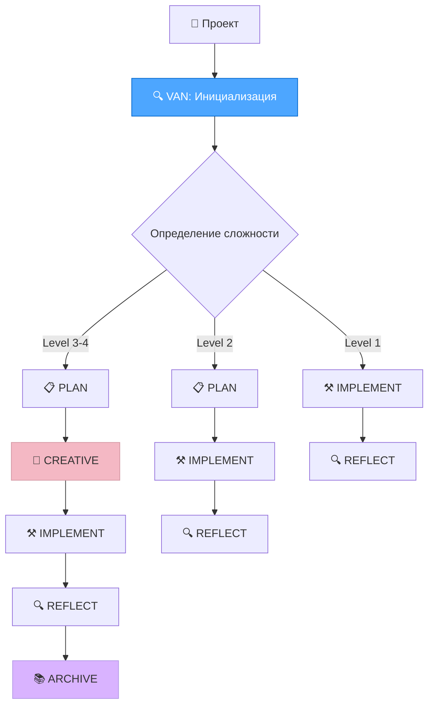

# Cursor Memory Bank System — Альтернативный подход

Изучение репозитория [cursor-memory-bank](https://github.com/vanzan01/cursor-memory-bank) — готовой системы для структурированной разработки с использованием кастомных режимов Cursor.

## Что это такое

**Cursor Memory Bank System** — это модульная, документо-ориентированная система, которая использует кастомные режимы Cursor для создания структурированного workflow разработки с визуальными картами процессов.

### 🎯 Ключевые особенности:

- **6 кастомных режимов** в Cursor для разных фаз разработки
- **Иерархическая загрузка правил** через `.cursor/rules/`
- **Визуальные карты процессов** для каждой фазы
- **Токен-оптимизированные шаблоны** для разной сложности задач
- **Персистентная память** между сессиями

## Архитектура системы



## Кастомные режимы

### 🔍 **VAN MODE** (Initialization)
- **Цель:** Анализ проекта и определение сложности
- **Инструменты:** Codebase Search, Read File, Terminal, List Directory
- **Результат:** Оценка уровня сложности (1-4) и выбор workflow

### 📋 **PLAN MODE** (Task Planning)  
- **Цель:** Детальное планирование реализации
- **Инструменты:** Codebase Search, Read File, Terminal, List Directory
- **Результат:** Структурированный план выполнения

### 🎨 **CREATIVE MODE** (Design Decisions)
- **Цель:** Исследование дизайнерских решений для сложных компонентов
- **Инструменты:** Codebase Search, Read File, Terminal, List Directory, Edit File
- **Особенность:** Использует Claude's "Think" tool для глубокого анализа

### ⚒️ **IMPLEMENT MODE** (Code Implementation)
- **Цель:** Систематическая реализация запланированных компонентов
- **Инструменты:** Все доступные инструменты
- **Результат:** Готовый код с документацией

### 🔍 **REFLECT MODE** (Review)
- **Цель:** Анализ результатов и извлечение уроков
- **Инструменты:** Codebase Search, Read File, Terminal, List Directory
- **Результат:** Документы анализа и рекомендации

### 📚 **ARCHIVE MODE** (Documentation)
- **Цель:** Создание comprehensive документации
- **Инструменты:** Codebase Search, Read File, Terminal, List Directory  
- **Результат:** Полная документация проекта

## Ключевые файлы системы

```
📁 .cursor/
└── rules/
    └── isolation_rules/    # Правила для каждого режима

📁 custom_modes/
├── van_instructions.md         # Инструкции для VAN режима
├── plan_instructions.md        # Инструкции для PLAN режима
├── creative_instructions.md    # Инструкции для CREATIVE режима
├── implement_instructions.md   # Инструкции для IMPLEMENT режима
└── reflect_archive_instructions.md # Инструкции для REFLECT/ARCHIVE

📁 Рабочие файлы:
├── tasks.md           # Центральный источник истины для задач
├── activeContext.md   # Текущий фокус разработки
├── progress.md        # Статус реализации
├── creative-*.md      # Документы дизайнерских решений
└── reflect-*.md       # Документы анализа
```

## Установка и настройка

### Шаг 1: Получение файлов
```bash
git clone https://github.com/vanzan01/cursor-memory-bank.git
# Или скачать и скопировать папки .cursor и custom_modes
```

### Шаг 2: Настройка кастомных режимов
**Критически важно:** Каждый режим нужно создать вручную в Cursor:

1. Открыть Cursor → выбрать режим в чате → "Add custom mode"
2. Для каждого режима:
   - Задать имя (например: 🔍 VAN)
   - Выбрать иконку
   - Включить нужные инструменты
   - В **Advanced options** вставить содержимое соответствующего файла

### Пример конфигурации VAN MODE:
- **Имя:** 🔍 VAN
- **Инструменты:** Codebase Search, Read File, Terminal, List Directory  
- **Advanced options:** Содержимое `custom_modes/van_instructions.md`

## Использование

### Базовый workflow:
1. **Переключиться на VAN режим** → ввести "VAN"
2. **Система определит сложность** и предложит workflow
3. **Следовать рекомендованному пути:**
   - **Level 1:** VAN → IMPLEMENT → REFLECT
   - **Level 2:** VAN → PLAN → IMPLEMENT → REFLECT  
   - **Level 3-4:** VAN → PLAN → CREATIVE → IMPLEMENT → REFLECT → ARCHIVE

### QA функциональность:
- Можно ввести "QA" в любом режиме для технической валидации
- Не отдельный режим, а набор функций проверки

## Преимущества системы

### ✅ **Готовность к использованию**
- Полностью настроенная система "из коробки"
- Протестированные workflows для разной сложности
- Визуальные карты процессов

### ✅ **Структурированность**
- Четкое разделение фаз разработки
- Персистентная память между сессиями
- Автоматический выбор workflow по сложности

### ✅ **Токен-оптимизация**
- Система оптимизирована для экономии токенов
- Модульная архитектура загружает только нужные правила
- Адаптивные шаблоны по сложности задач

### ✅ **Масштабируемость**
- Поддержка проектов любой сложности (Level 1-4)
- Легко расширяется новыми режимами
- Совместимость с различными технологическими стеками

## Недостатки и ограничения

### ❌ **Сложность настройки**
- Требует ручного создания 6 кастомных режимов
- Много копирования инструкций в Cursor
- Критична точность настройки каждого режима

### ❌ **Зависимость от Cursor**
- Работает только в Cursor IDE
- Требует поддержки кастомных режимов
- Ограничения Cursor влияют на функциональность

### ❌ **Жесткая структура**
- Навязывает определенный workflow
- Сложно адаптировать под специфические потребности
- Может быть избыточным для простых проектов

## Сравнение с нашим подходом

| Критерий | Cursor Memory Bank System | Наш Memory Bank подход |
|----------|---------------------------|------------------------|
| **Простота установки** | ❌ Сложная (6 режимов) | ✅ Простая (3 промпта) |
| **Готовность** | ✅ Готовая система | 🔶 Требует создания |
| **Гибкость** | ❌ Жесткая структура | ✅ Адаптируется под проект |
| **Зависимости** | ❌ Только Cursor | ✅ Любой AI (Claude, GPT) |
| **Персонализация** | ❌ Ограниченная | ✅ Полная под проект |
| **Workflow** | ✅ Структурированный | 🔶 Свободный |
| **Обучение AI** | 🔶 Режимы | ✅ MDC правила |

## Когда выбирать cursor-memory-bank

### ✅ **Подходит если:**
- Используете Cursor IDE как основной инструмент
- Нужна готовая структурированная система разработки
- Работаете над проектами разной сложности
- Команда готова следовать строгому workflow
- Хотите визуальные карты процессов

### ❌ **Не подходит если:**
- Используете другие IDE или AI-инструменты
- Нужна максимальная гибкость и персонализация
- Хотите простую настройку без сложной конфигурации
- Проект имеет специфические требования к workflow

## Практический пример использования

### Начало работы:
```
1. Переключаемся на VAN режим
2. Вводим: "VAN"
3. Система анализирует проект и предлагает:
   "Обнаружен React проект средней сложности (Level 2)
   Рекомендуемый workflow: VAN → PLAN → IMPLEMENT → REFLECT"
```

### Выполнение задачи:
```
4. Переключаемся на PLAN режим
5. Система создает tasks.md и activeContext.md
6. Переключаемся на IMPLEMENT режим  
7. Система систематически реализует план
8. Переключаемся на REFLECT режим
9. Система создает reflect-*.md с анализом
```

## Заключение

**Cursor Memory Bank System** — это мощная готовая система для структурированной разработки, которая отлично подходит для команд, использующих Cursor IDE и готовых следовать строгому workflow.

Это **альтернативный подход** к нашему методу создания персонализированного Memory Bank:
- **Наш подход:** Создание AI, понимающего ваш проект
- **Cursor Memory Bank:** Готовая система для структурированной разработки

Выбор зависит от ваших потребностей: готовая структура vs персонализированный AI помощник.

---

*Подробнее: [GitHub Repository](https://github.com/vanzan01/cursor-memory-bank)* 