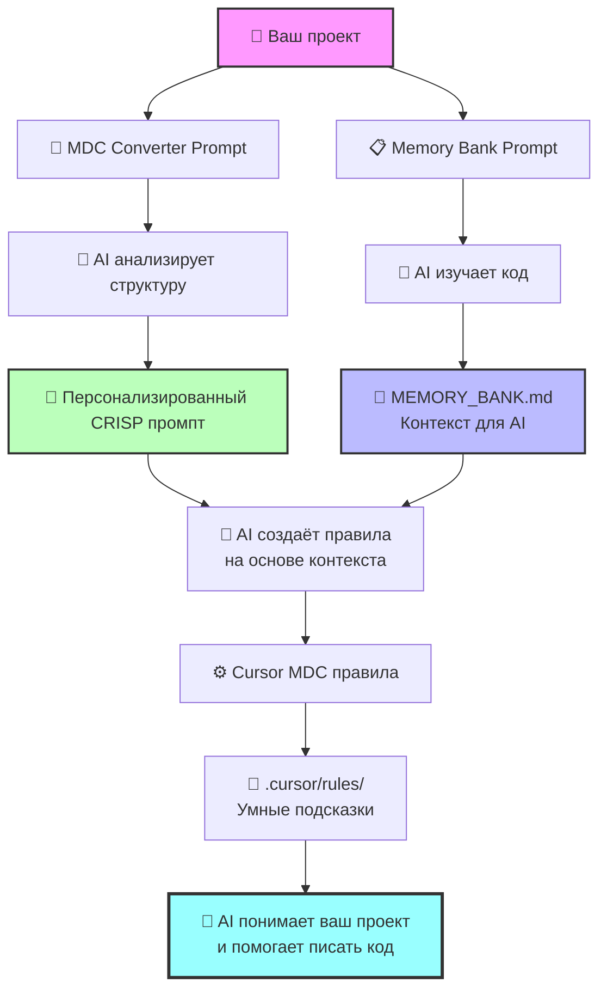

# Руководство по Memory Bank и CRISP промптам

## Что такое Memory Bank

Memory Bank — это структурированный контекст для AI агента, содержащий знания о вашем проекте. Он включает:

- **Паттерны кодирования** — как команда решает типовые задачи
- **Архитектурные решения** — почему выбраны определенные подходы
- **Контекст проекта** — технологии, ограничения, цели
- **Подводные камни** — что нужно избегать в проекте
- **Примеры из реального кода** — конкретные реализации паттернов

### Зачем нужен Memory Bank для AI?

1. **Контекстуальное понимание** — AI знает специфику вашего проекта
2. **Качественные предложения** — AI предлагает код в стиле команды  
3. **Архитектурная согласованность** — новый код соответствует существующим паттернам
4. **Избежание ошибок** — AI знает о подводных камнях проекта
5. **Ускорение разработки** — AI сразу предлагает подходящие решения

## CRISP Framework для промптов

**CRISP** — это фреймворк для создания четких и эффективных промптов:

- **C**ontext — контекст задачи
- **R**ole — роль, которую должен выполнять AI
- **I**nput — источники данных для анализа
- **S**pecifics — конкретные требования и ограничения  
- **P**atterns — структура вывода

### Преимущества CRISP подхода:

1. **Четкость целей** — каждая секция имеет конкретную функцию
2. **Воспроизводимость** — структурированный подход дает предсказуемые результаты
3. **Полнота** — фреймворк покрывает все аспекты хорошего промпта
4. **Масштабируемость** — легко адаптировать под разные задачи

### Детальное описание секций

#### Context (Контекст)
Описывает ситуацию и цель анализа:
- **Что анализируем** — тип проекта, технологии
- **Зачем анализируем** — цель создания Memory Bank
- **Какая аудитория** — кто будет использовать результат

**Примеры хорошего Context:**
```
✅ "Ты анализируешь React/TypeScript проект для создания memory-bank"
✅ "Рефакторинг устаревших компонентов в React приложении"
❌ "Анализируй проект" (слишком общее)
```

#### Role (Роль)
Определяет экспертизу и точку зрения AI:
- **Уровень экспертизы** — junior, middle, senior
- **Специализация** — frontend, backend, fullstack, QA
- **Фокус** — архитектура, производительность, безопасность

**Примеры хорошей Role:**
```
✅ "Senior developer, который документирует неявные знания команды"
✅ "Frontend architect, создающий план миграции"
❌ "Разработчик" (недостаточно специфично)
```

#### Input (Источники данных)
Указывает, какие файлы и директории анализировать:
- **Конкретные пути** — @src/components, @tests
- **Типы файлов** — *.tsx, *.test.ts
- **Документация** — README, архитектурные решения

**Примеры хорошего Input:**
```
✅ "@src/components — анализ компонентов"
✅ "@docs/architecture.md — контекст решений"
❌ "Код проекта" (слишком общее)
```

#### Specifics (Требования)
Конкретные задачи и ограничения:
- **Что искать** — паттерны, антипаттерны, проблемы
- **Как структурировать** — формат вывода
- **Что учесть** — ограничения, стандарты команды

**Примеры хороших Specifics:**
```
✅ "Найди самые часто используемые паттерны"
✅ "Покажи по 1-2 примера из разных файлов"
❌ "Проанализируй всё" (нет конкретики)
```

#### Patterns (Структура вывода)
Шаблон для форматирования результата:
- **Заголовки разделов** — четкая иерархия
- **Обязательные поля** — что должно быть в каждом разделе
- **Примеры форматирования** — как оформлять код

## Трёхэтапный процесс работы

### 🎯 Общая логика

Процесс создания Memory Bank и конвертации в Cursor MDC правила состоит из трёх этапов:

1. **Промпт → Memory Bank** — AI анализирует код и создаёт документацию паттернов
2. **Мета-промпт → Персонализированный CRISP промпт** — AI анализирует проект и создаёт специализированный промпт
3. **CRISP промпт + Memory Bank → MDC правила** — AI создаёт готовые правила для Cursor

### 📋 Детальные шаги

#### Этап 1: Создание Memory Bank

**Ваши действия:**
1. Берёте готовый CRISP промпт из [memory-bank-prompt.md](./memory-bank-prompt.md)
2. Адаптируете пути и технологии под ваш проект
3. Даёте промпт AI с доступом к кодовой базе

**Результат AI:** Файл `MEMORY_BANK.md` с паттернами вашего проекта

#### Этап 2: Создание персонализированного промпта

**Ваши действия:**
1. Берёте мета-промпт из [mdc-converter-prompt.md](./mdc-converter-prompt.md)  
2. Даёте его AI для анализа вашего проекта

**Результат AI:** Персонализированный CRISP промпт, адаптированный под ваши технологии и команду

#### Этап 3: Создание Cursor правил

**Ваши действия:**
1. Берёте созданный на этапе 2 CRISP промпт
2. Даёте его AI вместе с готовым Memory Bank

**Результат AI:** Готовые MDC файлы для папки `.cursor/rules/`

## Пошаговое руководство

### Подготовка
1. **Определите цель** — зачем создаете Memory Bank для AI
2. **Подготовьте доступ** к кодовой базе и документации
3. **Определите технологический стек** для адаптации промпта

### Этап 1: Memory Bank

#### Шаг 1: Взять промпт
Возьмите готовый CRISP промпт из файла [memory-bank-prompt.md](./memory-bank-prompt.md) — он подходит для анализа любого React/TypeScript проекта.

#### Шаг 2: Адаптация промпта
Модифицируйте под ваш проект:

**Context:** Опишите специфику
```
Context: Ты анализируешь [ваш тип проекта] для создания memory-bank
```

**Input:** Укажите актуальные пути
```
Input: Используй @src/[ваша_структура] для примеров
```

**Specifics:** Добавьте требования команды
```
- Учти наши стандарты [конкретные стандарты]  
- Проанализируй интеграции с [внешние системы]
```

#### Шаг 3: Выполнение
1. **Дайте промпт AI** с доступом к кодовой базе
2. **Проверьте качество** — есть ли реальные примеры кода
3. **Дополните знаниями** — добавьте контекст, невидимый в коде

#### Шаг 4: Валидация
1. **Review с командой** — соберите обратную связь
2. **Дополните паттерны** — добавьте недостающие
3. **Исправьте неточности** — уточните примеры кода
4. **Добавьте контекст** — почему принимались решения

### Этап 2: Персонализированный CRISP промпт

#### Шаг 1: Мета-промпт
Возьмите мета-промпт из [mdc-converter-prompt.md](./mdc-converter-prompt.md) — он проанализирует ваш проект и создаст специализированный CRISP промпт

#### Шаг 2: Выполнение  
Дайте мета-промпт AI, он создаст промпт, адаптированный под:
- Ваш технологический стек
- Архитектурные паттерны
- Размер и тип команды
- Специфику проекта

### Этап 3: Cursor MDC правила

#### Шаг 1: Применение CRISP промпта
Дайте AI созданный на этапе 2 промпт вместе с готовым Memory Bank

#### Шаг 2: Получение результата
AI создаст структуру MDC файлов для `.cursor/rules/` с правилами, идеально подходящими под ваш проект

## Структура итогового Memory Bank

```markdown
# MEMORY_BANK.md

## Архитектурные паттерны
### Barrel exports (index.ts)
### Alias imports (@/components)

## Паттерны компонентов  
### Props интерфейсы
### Условная стилизация
### Композиция компонентов

## Управление состоянием
### Zustand slices
### Persist middleware

## Стилизация
### CSS Modules паттерны
### Responsive design

## Тестирование
### AAA структура
### Мокирование API
### Page Objects

## Подводные камни
### TypeScript any запреты
### Performance антипаттерны
### Testing gotchas

## Эволюция кода
### Миграция с Redux на Zustand
### Обновление паттернов тестирования
```

## Практические советы

### ✅ Лучшие практики

**При создании контекста для AI:**
- Используйте конкретные пути к файлам проекта
- Просите примеры из реального кода, а не абстрактные
- Включайте архитектурные решения и их обоснования
- Фокусируйтесь на паттернах, специфичных для вашего проекта

**При валидации Memory Bank:**
- Проверяйте, что примеры кода актуальны
- Добавляйте контекст принятия архитектурных решений  
- Указывайте ограничения и особенности проекта
- Описывайте trade-offs выбранных решений

### ❌ Что избегать

**При создании контекста для AI:**
- Слишком общих формулировок без привязки к проекту
- Копирования очевидной информации из документации
- Игнорирования специфики вашего технологического стека
- Создания слишком объемного контекста без структуры

**В Memory Bank:**
- Абстрактных примеров без привязки к реальному коду
- Описания только "как", без объяснения "почему"
- Устаревших паттернов без указания их статуса
- Паттернов без контекста их применимости

## Поддержка контекста AI

Memory Bank — это живой контекст для AI, который требует регулярного обновления:

### Регулярное обновление
- **Каждые 3-6 месяцев** — полный аудит актуальности
- **После архитектурных изменений** — обновление затронутых паттернов
- **При смене технологий** — адаптация под новый стек

### Процесс обновления
1. **Запуск промптов** на текущей кодовой базе
2. **Сравнение** с существующим Memory Bank
3. **Добавление новых паттернов** и архитектурных решений
4. **Обновление устаревших** разделов с пометками
5. **Регенерация MDC правил** для Cursor

### Контроль качества
- Тестируйте качество предложений AI на реальных задачах
- Проверяйте соответствие генерируемого кода стилю команды
- Обновляйте правила при появлении нежелательных паттернов

## Визуализация процесса

Полный workflow создания умного AI агента для вашего проекта:



---

## Заключение

Memory Bank и CRISP промпты — это инструменты для создания контекста для AI агента. Трёхэтапный процесс поможет:

- 🧠 **Обучить AI** паттернам вашего проекта
- 🎯 **Получать точные предложения** кода в стиле команды
- 🏗️ **Поддерживать архитектурную согласованность** 
- ⚡ **Ускорить разработку** с умным AI-помощником
- 🤖 **Автоматизировать подсказки** в Cursor IDE

*Начните с простого анализа одной области (например, компонентов) и пройдите все три этапа для создания AI агента, который понимает ваш проект.* 