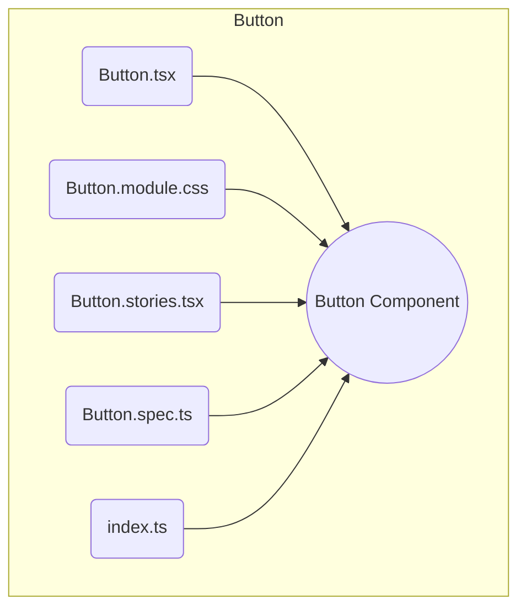

# Пакет @shri/ui-kit

## Описание

`@shri/ui-kit` — это пакет в рамках монорепозитория, который содержит все переиспользуемые UI-компоненты проекта. Он полностью изолирован от основной бизнес-логики приложения и может быть разработан и протестирован независимо.

## Структура пакета

Ключевой принцип — **колокация**. Все файлы, относящиеся к одному компоненту (логика, стили, истории для Storybook, тесты), лежат в одной директории.



-   `src/`: Исходный код компонентов, иконок и типов.
    -   `components/`: Директория со всеми UI-компонентами.
        -   `Button/`: Пример папки компонента.
            -   `index.ts`: Экспорт компонента.
        -   `Button.tsx`: Реализация компонента.
            -   `Button.module.css`: CSS-модуль.
            -   `Button.stories.tsx`: "Истории" для Storybook.
            -   `Button.spec.ts`: Скриншот-тест Playwright.
    -   `icons/`: Изолированные SVG-иконки.
-   `.storybook/`: Конфигурация Storybook для этого пакета.
-   `package.json`: Зависимости и скрипты пакета.

## Использование

Для использования компонентов или иконок из этого пакета в основном приложении, импортируйте их напрямую из соответствующих директорий:

```tsx
// Импорт компонента
import { Button } from '@shri/ui-kit/components/Button';

// Импорт иконки
import { History } from '@shri/ui-kit/icons/History';
```

## Storybook

Для локальной разработки и визуального тестирования компонентов используется Storybook. Чтобы запустить его, выполните из корня проекта:

```bash
npm run storybook
```

Эта команда запустит Storybook для пакета `ui-kit` и откроет его в браузере. 