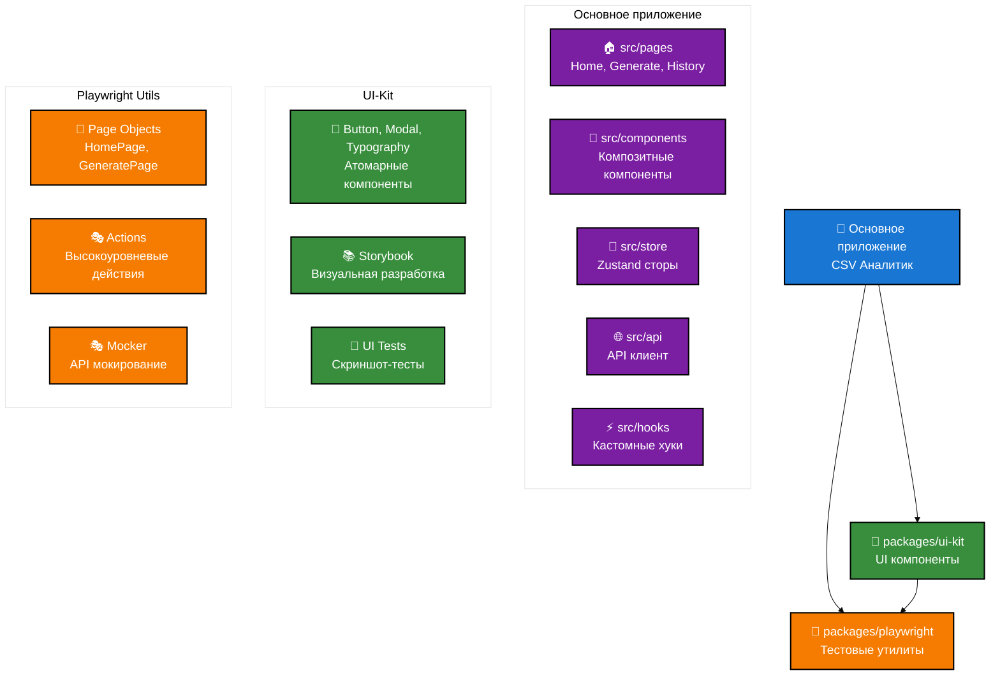
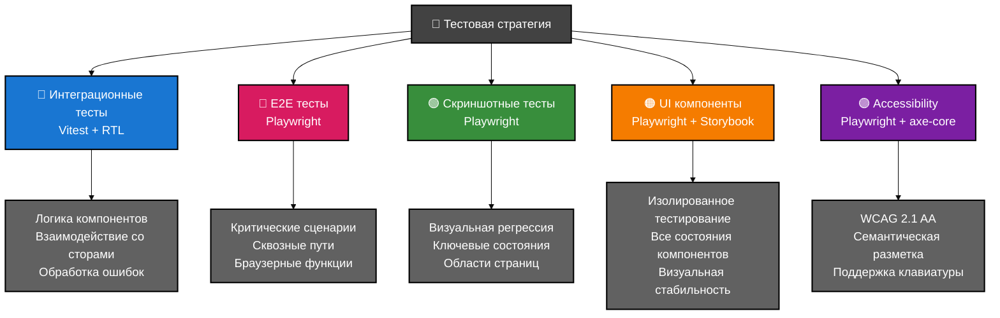
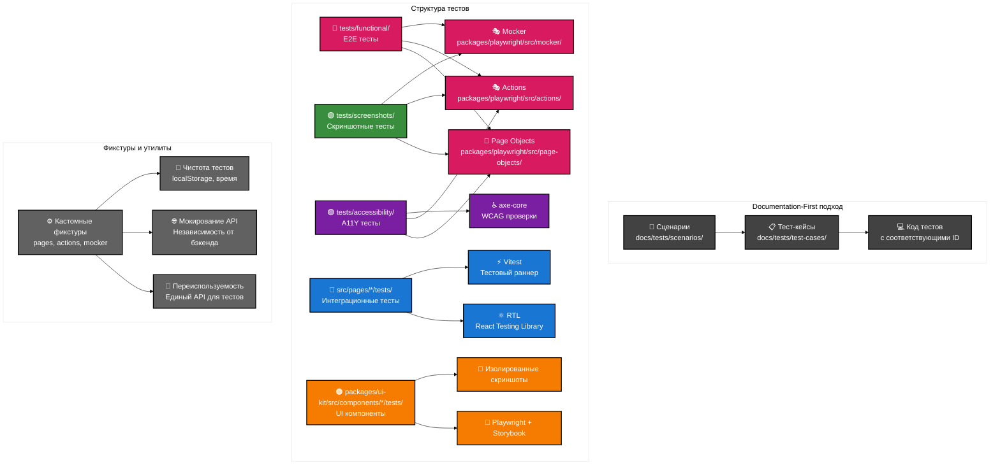
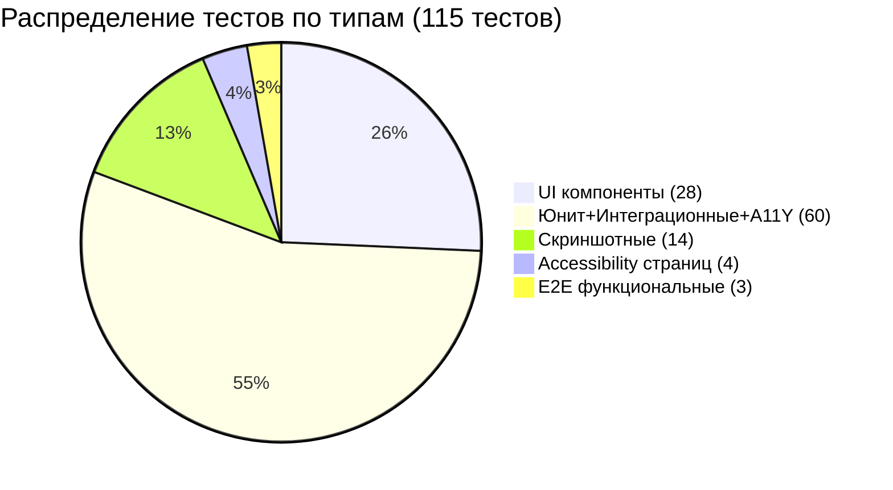

# Презентация: Покрытие автотестами Сервиса межгалактической аналитики

## Обзор проекта

**Сервис межгалактической аналитики** - веб-приложение для анализа CSV файлов, разработанное в рамках Школы разработки интерфейсов Яндекса 2025. Проект демонстрирует комплексное покрытие автотестами с использованием современных подходов и инструментов.

## 1. Архитектура проекта и подходы к тестированию

### Архитектура монорепозитория

Проект построен по принципу **монорепозитория** с использованием `npm workspaces`. Это архитектурное решение было принято по следующим причинам:

**Почему монорепозиторий:**
- **Единая версионность** - все пакеты развиваются синхронно, исключены проблемы совместимости
- **Переиспользование кода** - UI-компоненты и тестовые утилиты доступны всем частям проекта
- **Упрощенный CI/CD** - один pipeline для всего проекта, автоматическое тестирование зависимостей
- **Атомарные изменения** - возможность изменить API и всех его потребителей в одном коммите
- **Общие стандарты** - единые правила кодирования, линтинга и тестирования для всех пакетов



**Ключевые особенности архитектуры:**

1. **Основное приложение** - содержит бизнес-логику, страницы и управление состоянием
   - *Обоснование:* Сосредоточение специфичной для домена логики в корне проекта обеспечивает ясную архитектуру

2. **@shri/ui-kit** - изолированные, переиспользуемые UI-компоненты с собственными тестами
   - *Обоснование:* Выделение UI-компонентов в отдельный пакет позволяет:
     - Тестировать компоненты в изоляции от бизнес-логики
     - Переиспользовать в других проектах
     - Разрабатывать UI независимо от основного приложения через Storybook
     - Обеспечить стабильность через визуальные регрессионные тесты

3. **@shri/playwright** - централизованные утилиты для тестирования
   - *Обоснование:* Централизация тестовых утилит исключает дублирование кода и обеспечивает:
     - Единообразный API для всех типов тестов
     - Переиспользование Page Objects и Actions
     - Централизованное управление моками
     - Легкость поддержки и рефакторинга

### Стратегия тестирования

Мы выделили 4 основных типа тестов на основе пирамиды тестирования и специфики веб-приложений. Каждый тип решает конкретные задачи и имеет свои преимущества:

**Принципы выбора стратегии:**
- **Скорость выполнения** - приоритет быстрым тестам
- **Стабильность** - минимизация flaky-тестов
- **Стоимость поддержки** - легкость в написании и поддержке
- **Уверенность в качестве** - максимальное покрытие критических сценариев
- **Изоляция проблем** - быстрая локализация багов



**Принцип выбора типа теста:**

> "Нужен ли для этой проверки реальный браузер?"

- **НЕТ** → Интеграционный тест (быстрее, стабильнее)
- **ДА, для отдельного компонента** → UI компонент тест
- **ДА, для верстки страницы** → Скриншотный тест
- **ДА, для сквозного сценария** → E2E тест

## 2. Documentation-First процесс

### Процесс создания тестов

Каждый тест в проекте начинается с документации. Этот подход был выбран для решения типичных проблем тестирования:

**Проблемы, которые решает Documentation-First:**
- **Потеря контекста** - без документации через время непонятно, что именно тестирует тест
- **Дублирование тестов** - разработчики могут создавать похожие тесты, не зная о существующих
- **Неполное покрытие** - без системного подхода легко пропустить важные сценарии
- **Сложность коммуникации** - без единого формата сложно обсуждать тесты с командой
- **Отсутствие трассируемости** - нет связи между бизнес-требованиями и тестами

**Преимущества нашего подхода:**
- **Планирование до кодирования** - продумываем сценарии перед написанием кода
- **Единый источник истины** - документация как контракт между участниками
- **Review требований** - можно обсуждать тесты до их реализации
- **Онбординг новых участников** - понятная структура для изучения проекта
- **Аудит покрытия** - легко увидеть, что протестировано, а что нет

**Процесс состоит из трех этапов:**

1. **Сценарий** (`docs/tests/scenarios/`) - описание пользовательского поведения в свободной форме
2. **Тест-кейс** (`docs/tests/test-cases/`) - структурированные шаги с ID и ожидаемыми результатами
3. **Код теста** - реализация с соответствующим ID для трассируемости

### Пример: от сценария к коду

**Сценарий** (из `docs/tests/scenarios/home-page.md`):
```markdown
### Сценарий 1: Успешная загрузка и обработка файла через "выбор файла"

**Описание:** Пользователь успешно загружает CSV файл, нажав на кнопку выбора файла, отправляет его на обработку и видит результаты.

**Шаги:**
1. Пользователь открывает главную страницу.
2. Нажимает на кнопку "Загрузить файл" в области Dropzone.
3. Выбирает корректный CSV файл в диалоговом окне.
4. Имя файла отображается в Dropzone.
5. Кнопка "Отправить" становится активной.
6. Пользователь нажимает "Отправить".
7. На время обработки данных отображается лоадер.
8. После успешного завершения обработки лоадер исчезает, и на странице появляются карточки с результатами обработки ("хайлайты").
```

**Тест-кейс** (из `docs/tests/test-cases/home-page.md`):
```markdown
### ID: TC-HP-001

**Название:** Успешная загрузка и обработка CSV файла через кнопку "Загрузить файл".
**Тип теста:** Функциональный (E2E)
**Описание:** Проверка полного цикла успешной загрузки файла через клик по кнопке, отправки на обработку и отображения результатов.
**Предусловие:** Пользователь находится на странице "Главная" (`/`). Ответ от сервера с результатами замокан.
```

**Код теста** (из `tests/functional/home.spec.ts`):
```typescript
test('TC-HP-001: Успешная загрузка и обработка CSV файла через кнопку "Загрузить файл"', async ({
    pages,
    actions,
}) => {
    // Arrange
    const filePath = path.join(__dirname, '..', 'test-data', 'test-data.csv');
    const fileName = 'test-data.csv';

    // Act & Assert
    await test.step('Шаг 1 и 2: Нажать на кнопку "Загрузить файл" и выбрать валидный .csv файл', async () => {
        await actions.home.uploadFile(filePath);
        await expect(pages.home.dropzone).toContainText(fileName);
    });
});
```

## 3. Покрытие тестами по страницам

### Карта покрытия

Всего в проекте **115 тест-кейсов** (фактические замеры), распределенных по страницам и компонентам:

**⚠️ Примечание:** Диаграмма показывает основные группы тестов. В реальном проекте также выполняются A11Y тесты компонентов (входят в общую сумму 66 тестов Vitest), что объясняет разницу в цифрах диаграммы и общего итога.

```mermaid
%%{init: {'theme':'base', 'themeVariables': { 'fontSize': '18px', 'fontFamily': 'Arial', 'primaryColor': '#ffffff', 'primaryTextColor': '#000000'}}}%%
graph TD
    A["📊 Всего тестов: 115"] --> B["🏠 Home Page<br/>13 тест-кейсов"]
    A --> C["📄 Generate Page<br/>6 тест-кейсов"]
    A --> D["📋 History Page<br/>10 тест-кейсов"]
    A --> E["🎨 UI Components<br/>28 тестов"]
    A --> F["♿ Accessibility<br/>4 теста"]
    A --> G["⚡ Юнит-тесты<br/>39 тестов"]
    
    B --> B1["🔴 E2E: 2 теста"]
    B --> B2["🔵 INT: 4 теста"]
    B --> B3["🟢 SCREENSHOT: 7 тестов"]
    
    C --> C1["🔴 E2E: 1 тест"]
    C --> C2["🔵 INT: 1 тест"]
    C --> C3["🟢 SCREENSHOT: 4 теста"]
    
    D --> D1["🔵 INT: 7 тестов"]
    D --> D2["🟢 SCREENSHOT: 3 теста"]
    
    E --> E1["🟠 Button: 8 тестов"]
    E --> E2["🟠 Typography: 9 тестов"]
    E --> E3["🟠 Другие: 11 тестов"]
    
    F --> F1["🟣 Страницы: 3 теста"]
    F --> F2["🟣 Компоненты: 1 тест"]
    
    G --> G1["⚫ API: 8 тестов"]
    G --> G2["⚫ Utils: 31 тест"]
    
    %% Стили с контрастными цветами
    classDef main fill:#424242,stroke:#000,stroke-width:2px,color:#fff
    classDef pages fill:#2196f3,stroke:#000,stroke-width:2px,color:#fff
    classDef e2e fill:#d81b60,stroke:#000,stroke-width:2px,color:#fff
    classDef integration fill:#1976d2,stroke:#000,stroke-width:2px,color:#fff
    classDef screenshot fill:#388e3c,stroke:#000,stroke-width:2px,color:#fff
    classDef ui fill:#f57c00,stroke:#000,stroke-width:2px,color:#fff
    classDef a11y fill:#7b1fa2,stroke:#000,stroke-width:2px,color:#fff
    classDef unit fill:#616161,stroke:#000,stroke-width:2px,color:#fff
    
    class A main
    class B,C,D,E,F,G pages
    class B1,C1 e2e
    class B2,C2,D1 integration
    class B3,C3,D2 screenshot
    class E1,E2,E3 ui
    class F1,F2 a11y
    class G1,G2 unit
```



**Легенда:**
- 🔴 E2E тесты - критические сценарии (розовый цвет)
- 🔵 Интеграционные тесты - основная логика (синий цвет)
- 🟢 Скриншотные тесты - визуальная регрессия (зеленый цвет)
- 🟠 UI компоненты - изолированное тестирование (оранжевый цвет)
- 🟣 Accessibility - проверка доступности (фиолетовый цвет)
- ⚫ Юнит-тесты - тестирование в изоляции (серый цвет)

## 4. Интеграционные тесты - основа функциональности

### Принципы интеграционного тестирования

Интеграционные тесты составляют **основу** нашего функционального покрытия (11% от общего количества, но покрывают ключевую бизнес-логику). Этот выбор обоснован следующими факторами:

**Почему интеграционные тесты как основа:**

1. **Оптимальное соотношение скорость/уверенность**
   - Выполняются в 100 раз быстрее E2E тестов (миллисекунды vs секунды)
   - Предоставляют высокую уверенность в корректности интеграции компонентов
   - Позволяют быстро локализовать проблемы на уровне конкретного компонента

2. **Стабильность и предсказуемость**
   - Отсутствие сетевых запросов исключает таймауты и сетевые ошибки
   - Моки обеспечивают детерминированное поведение
   - Нет зависимости от внешних сервисов и их состояния

3. **Покрытие бизнес-логики**
   - Тестируют взаимодействие между компонентами, хуками и сторами
   - Проверяют обработку пользовательского ввода и состояний
   - Валидируют логику без браузерных ограничений

4. **Простота отладки**
   - Лёгкий доступ к внутреннему состоянию компонентов
   - Синхронное выполнение упрощает понимание потока
   - Детальные сообщения об ошибках в React Testing Library

### Структура интеграционного теста

Каждый тест следует паттерну **AAA** (Arrange-Act-Assert):

```typescript
// src/pages/Home/__tests__/HomePage.integration.test.tsx
describe('Интеграционные тесты для HomePage', () => {
    beforeEach(() => {
        // Сбрасываем состояние стора перед каждым тестом
        useAnalysisStore.setState(initialAnalysisState, true);
    });

    it('TC-HP-003: Попытка загрузки файла с неверным расширением', async () => {
        // Arrange
        render(
            <MemoryRouter
                future={{
                    v7_startTransition: true,
                    v7_relativeSplatPath: true,
                }}
            >
                <HomePage />
            </MemoryRouter>
        );

        // Act
        const fileInput = screen.getByTestId('dropzone-input');
        const invalidFile = new File(['hello'], 'invalid-file.txt', { type: 'text/plain' });
        fireEvent.change(fileInput, {
            target: { files: [invalidFile] },
        });

        // Assert
        const errorMessage = await screen.findByText('Можно загружать только *.csv файлы');
        expect(errorMessage).toBeInTheDocument();
    });
});
```

### Ключевые архитектурные решения

1. **Локальный сброс состояния сторов**
   ```typescript
   const initialState = useAnalysisStore.getState();
   beforeEach(() => {
       useAnalysisStore.setState(initialState, true);
   });
   ```
   - *Обоснование:* Изоляция тестов друг от друга. Глобальный сброс в `vitest.setup.ts` может вызвать проблемы с разрешением путей в монорепозитории

2. **Мокирование API через fetch**
   ```typescript
   global.fetch = vi.fn().mockImplementation(() => Promise.resolve({
       ok: false,
       status: 500,
       json: () => Promise.resolve({ error: errorText }),
   }));
   ```
   - *Обоснование:* Полный контроль над ответами API, тестирование всех сценариев (успех, ошибки, таймауты) без зависимости от бэкенда

3. **MemoryRouter для навигационных тестов**
   ```typescript
   <MemoryRouter future={{ v7_startTransition: true, v7_relativeSplatPath: true }}>
       <HistoryPage />
   </MemoryRouter>
   ```
   - *Обоснование:* Тестирование компонентов с `<Link>` без запуска полного роутера. Флаги `future` обеспечивают совместимость с React Router v7

4. **fireEvent.change для загрузки файлов**
   ```typescript
   fireEvent.change(fileInput, { target: { files: [validFile] } });
   ```
   - *Обоснование:* `userEvent.upload` несовместим с нашим компонентом `Dropzone`. `fireEvent` обеспечивает прямую симуляцию события изменения

## 5. E2E тесты и архитектура Page Objects

### Минималистичный подход к E2E тестам

**Почему всего 3 E2E теста (3% от общего количества):**

E2E тесты в нашем проекте используются исключительно для критических сценариев, которые **невозможно** протестировать на более низком уровне:

1. **TC-HP-001 & TC-HP-002** - Загрузка файлов через кнопку и Drag&Drop
   - *Обоснование:* Взаимодействие с файловой системой операционной системы возможно только в реальном браузере
   - Тестирует системные диалоги выбора файлов и API перетаскивания

2. **TC-GP-001** - Генерация и скачивание отчета
   - *Обоснование:* Скачивание файлов - браузерная функциональность, недоступная в jsdom
   - Проверяет создание blob, URL.createObjectURL и программный клик по ссылке

**Принципы ограничения E2E тестов:**
- **Высокая стоимость** - медленные в выполнении и написании
- **Низкая стабильность** - подвержены flaky-поведению
- **Сложность отладки** - трудно локализовать проблемы
- **Перекрытие с интеграционными** - большинство логики уже покрыто быстрыми тестами

### Архитектура тестирования

E2E тесты построены на принципах максимального переиспользования и читаемости:



### Кастомные фикстуры

Все E2E тесты используют кастомные фикстуры из `@shri/playwright`. Это решение обеспечивает единообразие и исключает дублирование кода:

**Преимущества кастомных фикстур:**
- **Единый API** - все тесты используют одинаковый интерфейс (`pages`, `actions`, `mocker`)
- **Автоматическая очистка** - фикстуры сами управляют жизненным циклом объектов
- **Инкапсуляция сложности** - скрывают детали создания и настройки объектов
- **Переиспользование** - один раз написанные утилиты доступны всем тестам
- **Типизация** - полная поддержка TypeScript для автокомплита и проверки типов

```typescript
// packages/playwright/src/support/fixtures.ts
const test = base.extend<MyFixtures>({
    pages: async ({ page }, use) => {
        const pages = {
            home: new pageClasses.home(page),
            generate: new pageClasses.generate(page),
            history: new pageClasses.history(page),
            storybook: new pageClasses.storybook(page),
        };
        await use(pages);
    },
    actions: async ({ page, pages }, use) => {
        const actions = {
            home: new actionClasses.home(page, pages),
            generate: new actionClasses.generate(page, pages),
            history: new actionClasses.history(page, pages),
            storybook: new actionClasses.storybook(page, pages),
        };
        await use(actions);
    },
    mocker: async ({ page }, use) => {
        const mocker = new mockClasses.mocker(page);
        await use(mocker);
        await mocker.unmockAll();
    },
});
```

### Page Objects - инкапсуляция селекторов

Page Objects инкапсулируют логику поиска элементов и предоставляют стабильный API для тестов:

**Почему Page Objects важны:**
- **Централизация селекторов** - все локаторы для страницы в одном месте
- **Устойчивость к изменениям** - при изменении разметки правим только Page Object
- **Читаемость тестов** - `pages.home.dropzone.click()` понятнее чем `page.getByTestId('dropzone')`
- **Переиспользование** - один локатор доступен всем тестам страницы
- **Типизация** - автокомплит и проверка существования элементов

**Архитектурные принципы:**
- **Базовый класс** - `BasePage` обеспечивает единообразие
- **Композиция** - сложные элементы (модалы) выносятся в отдельные классы
- **Ленивые геттеры** - элементы ищутся только при обращении

```typescript
// packages/playwright/src/page-objects/pages/homePage.ts
export class HomePage extends BasePage {
    constructor(page: Page) {
        super(page, 'home-page');
    }

    public get dropzone() {
        return this.root.getByTestId('dropzone');
    }

    public get sendButton() {
        return this.root.getByTestId('send-button');
    }

    public get highlightsGrid() {
        return this.root.getByTestId('highlights-grid');
    }

    public get loader() {
        return this.root.getByTestId('loader');
    }
}
```

### Actions - высокоуровневые пользовательские действия

Actions инкапсулируют сложные пользовательские сценарии и обеспечивают декларативность тестов:

**Преимущества Actions паттерна:**
- **Декларативность** - `actions.home.uploadFile()` vs множество низкоуровневых вызовов
- **Переиспользование логики** - сложные действия доступны всем тестам
- **Скрытие сложности** - тестам не нужно знать, как именно работает drag&drop
- **Стабильность** - все ожидания и синхронизация инкапсулированы в Actions
- **Читаемость** - тест читается как пользовательский сценарий

**Принципы проектирования Actions:**
- **Один Action = одно пользовательское действие** - загрузка файла, отправка формы
- **Инкапсуляция ожиданий** - Actions сами ждут завершения асинхронных операций  
- **Обработка разных способов** - один метод может поддерживать клик и drag&drop
- **Возврат результатов** - Actions могут возвращать данные для проверок в тестах

```typescript
// packages/playwright/src/actions/homeActions.ts
export class HomeActions {
    public async uploadFile(filePath: string) {
        const fileChooserPromise = this.page.waitForEvent('filechooser');
        await this.pages.home.dropzone.click();
        const fileChooser = await fileChooserPromise;
        await fileChooser.setFiles(filePath);
    }

    public async uploadFileWithDragAndDrop(filePath: string, fileName: string) {
        const buffer = await fs.readFile(filePath);
        const dataTransfer = await this.page.evaluateHandle(
            ({ buffer, fileName, fileType }) => {
                const dt = new DataTransfer();
                const file = new File([buffer], fileName, { type: fileType });
                dt.items.add(file);
                return dt;
            },
            { buffer, fileName, fileType: 'text/csv' }
        );

        await this.pages.home.dropzone.dispatchEvent('drop', { dataTransfer });
    }
}
```

### Пример E2E теста

```typescript
// tests/functional/home.spec.ts
test('TC-HP-002: Успешная загрузка и обработка CSV файла через Drag-and-Drop', async ({ pages, actions }) => {
    const filePath = path.join(__dirname, '..', 'test-data', 'test-data.csv');
    const fileName = 'test-data.csv';

    await test.step('Шаг 1: Перетащить валидный `.csv` файл', async () => {
        await actions.home.uploadFileWithDragAndDrop(filePath, fileName);
        
        await expect(pages.home.dropzoneContent).toContainText(fileName);
        await expect(pages.home.sendButton).toBeEnabled();
    });

    await test.step('Шаг 2: Нажать кнопку "Отправить"', async () => {
        await actions.home.send();
        
        await expect(pages.home.highlightsGrid).toBeVisible();
        const cards = await pages.home.highlightCard.all();
        expect(cards.length).toBe(8);
    });
});
```

## 6. Скриншотное тестирование

### Стратегия "областей вместо страниц"

Мы применяем принцип **"от страниц к областям"** - вместо скриншотов целых страниц создаём несколько сфокусированных снимков ключевых областей.

**Почему области лучше чем полные страницы:**

1. **Проблемы скриншотов целых страниц:**
   - **Высокая хрупкость** - изменение в Header ломает все страничные тесты
   - **Сложность диагностики** - непонятно, что именно изменилось
   - **False-positive срабатывания** - незначительные изменения общих компонентов
   - **Низкая переносимость** - разные размеры экранов дают разные результаты

2. **Преимущества области-ориентированного подхода:**
   - **Точечная локализация** - изменения влияют только на связанные тесты
   - **Быстрая диагностика** - сразу понятно, какой компонент изменился  
   - **Независимость областей** - Header и Content тестируются раздельно
   - **Стабильность** - изменения в одной области не влияют на другие

3. **Архитектурные принципы:**
   - **Семантическое разделение** - каждая область отвечает за свою функцию
   - **Настраиваемая толерантность** - `maxDiffPixelRatio: 0.05` для сглаживания
   - **Тестирование состояний** - каждое ключевое состояние имеет свой снимок

### Примеры скриншотных тестов

```typescript
// tests/screenshots/home.screenshot.spec.ts
const TEST_OPTIONS = { maxDiffPixelRatio: 0.05 };

test('TC-HP-007: Скриншот состояния страницы по умолчанию', async ({ pages }) => {
    await test.step('Шаг 1: Сделать и сравнить скриншот секции загрузки', async () => {
        await expect(pages.home.fileUploadSection).toHaveScreenshot(
            'home-page-upload-section-default.png', 
            TEST_OPTIONS
        );
    });
});

test('TC-HP-008: Скриншот состояния страницы с результатами', async ({ actions, mocker, pages }) => {
    await mocker.mock('**/aggregate*', successAnalysisMock);

    await test.step('Шаг 1: Загрузить валидный файл и дождаться результатов', async () => {
        await actions.home.uploadFile('tests/test-data/test-data.csv');
        await actions.home.send();
        await expect(pages.home.highlightsGrid).toBeVisible();
    });

    await test.step('Шаг 2: Сделать скриншот секции с результатами', async () => {
        await expect(pages.home.highlightsGrid).toHaveScreenshot(
            'home-page-highlights-section-success.png', 
            TEST_OPTIONS
        );
    });
});
```

### Покрытие различных состояний

Скриншотные тесты покрывают все ключевые состояния интерфейса:

- **Состояние по умолчанию** - первичный вид страницы
- **С загруженным файлом** - после выбора файла
- **В процессе загрузки** - с лоадером
- **С результатами** - после успешной обработки
- **С ошибкой** - при различных типах ошибок
- **Модальные окна** - попапы и диалоги

## 7. Тестирование UI компонентов

### Изолированное тестирование с Storybook

UI компоненты тестируются в полной изоляции с использованием связки Storybook + Playwright. Это решение обеспечивает максимальную стабильность и покрытие всех состояний:

**Почему Storybook + Playwright для UI тестов:**

1. **Полная изоляция компонентов:**
   - **Нет внешних зависимостей** - компонент тестируется без роутера, сторов, API
   - **Контролируемое окружение** - фиксированные пропсы и состояния
   - **Независимость от бизнес-логики** - изменения в приложении не ломают UI тесты

2. **Покрытие всех состояний:**
   - **Систематический подход** - каждое состояние компонента имеет историю в Storybook
   - **Визуальная документация** - разработчики видят все варианты компонента
   - **Регрессионная защита** - любое изменение внешнего вида сразу заметно

3. **Преимущества перед альтернативами:**
   - **vs Jest + jsdom** - реальный рендеринг в браузере, точные CSS и шрифты
   - **vs Chromatic** - локальный контроль, нет зависимости от внешних сервисов
   - **vs manual testing** - автоматическое выполнение, детекция изменений

```typescript
// packages/ui-kit/src/components/Button/Button.spec.ts
test('Компонент Button, состояние: primary @ui-snapshot', async ({ actions, pages }) => {
    // Arrange
    await actions.storybook.openStory('ui-button--primary');

    // Act
    await expect(pages.storybook.component).toBeVisible();

    // Assert
    await expect(pages.storybook.component).toHaveScreenshot('button-primary.png');
});

test('Компонент Button, состояние: disabled @ui-snapshot', async ({ actions, pages }) => {
    // Arrange
    await actions.storybook.openStory('ui-button--disabled');

    // Act
    await expect(pages.storybook.component).toBeVisible();

    // Assert
    await expect(pages.storybook.component).toHaveScreenshot('button-disabled.png');
});
```

### Покрытие всех состояний

Каждый компонент тестируется во всех возможных состояниях:

**Button** - 8 состояний:
- primary, secondary, disabled
- download, upload, clear
- fullWidth, isLoading

**Typography** - 8 состояний:
- размеры (s, m, l)
- цвета (default, light, error)
- веса (normal, bold)
- теги (p, h1, h2...)

**Modal** - взаимодействие:
- открытие/закрытие
- клик по backdrop
- кнопка закрытия

### Архитектура Storybook тестов

```typescript
// packages/playwright/src/actions/storybookActions.ts
export class StorybookActions {
    public async openStory(storyId: string): Promise<void> {
        await this.page.goto(`${STORYBOOK_BASE_URL}/iframe.html?id=${storyId}`, { 
            waitUntil: 'load' 
        });
    }
}

// packages/playwright/src/page-objects/pages/storybookPage.ts
export class StorybookPage {
    public get component() {
        return this.page.locator('#storybook-root');
    }

    public get modal() {
        return this.page.getByTestId('modal');
    }
}
```

## 8. Accessibility тестирование

### Автоматическая проверка доступности

Каждая страница автоматически проверяется на соответствие стандартам WCAG 2.1 AA с использованием axe-core:

**Почему автоматизированное A11Y тестирование критично:**

1. **Правовые требования:**
   - **Соответствие законодательству** - требования доступности в web стали обязательными
   - **Предотвращение судебных исков** - проактивная защита от претензий
   - **Корпоративная ответственность** - инклюзивность как часть корпоративных ценностей

2. **Техническая эффективность:**
   - **Раннее обнаружение** - проблемы выявляются на этапе разработки
   - **Автоматическое покрытие** - 30-40% проблем доступности детектируются автоматически
   - **Консистентность** - единые стандарты проверки для всех страниц
   - **Интеграция в CI/CD** - блокировка релизов с проблемами доступности

3. **Выбор axe-core как стандарта:**
   - **Отраслевое признание** - де-факто стандарт для автоматизированного A11Y тестирования
   - **Активная поддержка** - регулярные обновления и новые правила
   - **Интеграция с Playwright** - нативная поддержка через @axe-core/playwright

```typescript
// tests/accessibility/home.a11y.spec.ts
test('TC-A11Y-HOME-01: Главная страница должна быть доступна', async ({ actions, makeA11yScan }) => {
    // Arrange
    await actions.home.goto();

    // Act
    const violations = await makeA11yScan();

    // Assert
    expect(violations).toEqual([]);
});
```

### Кастомная фикстура для A11Y

```typescript
// packages/playwright/src/support/fixtures.ts
makeA11yScan: async ({ page }, use) => {
    const makeScan = async () => {
        const accessibilityScanResults = await new AxeBuilder({ page })
            .withTags(['wcag2a', 'wcag2aa', 'wcag21a', 'wcag21aa'])
            .analyze();
        return accessibilityScanResults.violations;
    };
    await use(makeScan);
},
```

### Покрытие A11Y проверок

- **Семантическая разметка** - правильное использование HTML тегов
- **ARIA атрибуты** - для сложных интерактивных элементов  
- **Поддержка клавиатуры** - навигация без мыши
- **Контрастность** - соответствие стандартам контрастности
- **Альтернативный текст** - для изображений и иконок

## 9. Мокирование и тестовые данные

### Класс Mocker - централизованное управление моками

Централизованное мокирование API через собственный класс Mocker обеспечивает полную независимость тестов от бэкенда:

**Преимущества собственного класса Mocker:**

1. **Единообразие API:**
   - **Консистентный интерфейс** - один метод для всех типов моков
   - **Типизированные параметры** - TypeScript контролирует корректность настроек
   - **Упрощенная конфигурация** - разумные дефолты для большинства случаев

2. **Продвинутые возможности:**
   - **Контроль задержек** - имитация медленных запросов для тестирования лоадеров
   - **Различные статус-коды** - тестирование обработки ошибок (400, 500, timeout)
   - **CORS заголовки** - корректная работа в браузерном окружении
   - **Автоматическая очистка** - освобождение ресурсов после каждого теста

3. **Альтернативы и их ограничения:**
   - **MSW (Mock Service Worker)** - избыточен для простых случаев, сложен в настройке
   - **Playwright route mocking** - низкоуровневый API, много boilerplate кода
   - **fetch mocking в Jest** - не работает в браузерном окружении Playwright

```typescript
// packages/playwright/src/mocker/mocker.ts
export class Mocker {
    public async mock(
        url: string | RegExp,
        responseData: MockResponse,
        options: { 
            status?: number; 
            delay?: number; 
            contentType?: string; 
            headers?: Record<string, string> 
        } = {}
    ) {
        const { status = 200, delay = 0, contentType = 'application/json', headers = {} } = options;
        
        await this.page.route(url, async (route: Route) => {
            if (delay > 0) {
                await new Promise((resolve) => setTimeout(resolve, delay));
            }

            const body = contentType === 'application/json' 
                ? JSON.stringify(responseData) 
                : String(responseData);

            return route.fulfill({
                status,
                headers: { 'Access-Control-Allow-Origin': '*', ...headers },
                contentType,
                body,
            });
        });
    }
}
```

### Структура тестовых данных

```typescript
// tests/test-data/mocks/analysis-success.ts
export const successAnalysisMock: Record<string, string | number> = {
    total_spend_galactic: 56789.1,
    rows_affected: 250,
    average_spend_galactic: 227.15,
    less_spent_at: 74,
    big_spent_at: 119,
    less_spent_value: 10.5,
    big_spent_value: 1050.75,
    less_spent_civ: 'blobs',
    big_spent_civ: 'humans',
};

// tests/test-data/mocks/analysis-error.ts
export const analysisErrorMock: Record<string, string> = {
    error: 'Internal Server Error',
    message: 'Something went wrong during analysis.',
};
```

### Использование в тестах

```typescript
test.beforeEach(async ({ actions, mocker }) => {
    // Мокируем успешный ответ API с задержкой
    await mocker.mock('**/aggregate*', successAnalysisMock, { delay: 200 });
    await actions.home.goto();
});

test('Тест с ошибкой API', async ({ mocker, actions }) => {
    // Переопределяем мок для конкретного теста
    await mocker.mock('**/aggregate*', analysisErrorMock, { status: 500 });
    
    await actions.home.uploadFile('test-data.csv');
    await actions.home.send();
    
    // Проверяем отображение ошибки
    await expect(pages.home.dropzoneError).toBeVisible();
});
```

## 10. Запуск тестов и автоматизация

### Скрипты для запуска

Проект предоставляет продуманную систему команд для различных типов тестирования:

**Принципы организации скриптов:**
- **Семантическое именование** - по типу тестов (`test:integration`, `test:e2e`)
- **Градация по сложности** - от простых к комплексным
- **Специальные режимы** - UI-режим для отладки, flaky-тесты для проверки стабильности
- **Параллельное выполнение** - максимальная скорость в CI/CD
- **Автоматическая конфигурация** - адаптация под окружение (CI vs локальная разработка)

```json
{
  "scripts": {
    "test:integration": "vitest run src/",
    "test:e2e": "playwright test tests/functional/",
    "test:e2e:ui": "playwright test --ui tests/functional/",
    "test:screenshots": "playwright test tests/screenshots/",
    "test:ui-snapshot": "playwright test packages/ui-kit/",
    "test:a11y": "playwright test tests/accessibility/",
    "test:flaky": "./scripts/flaky-test-run.sh",
    "test:flaky:all": "./scripts/flaky-test-run-all.sh"
  }
}
```

### Параллельное выполнение

```typescript
// playwright.config.ts
export default defineConfig({
    testDir: './tests',
    fullyParallel: true,
    workers: process.env.CI ? 2 : undefined,
    retries: process.env.CI ? 2 : 0,
    use: {
        trace: 'on-first-retry',
        screenshot: 'only-on-failure',
    },
    projects: [
        {
            name: 'chromium',
            use: { ...devices['Desktop Chrome'] },
        },
    ],
});
```

### Отчеты и артефакты

- **HTML отчеты** - детальная информация о тестах
- **Скриншоты** - при падении тестов
- **Трейсы** - для отладки flaky тестов
- **Видеозаписи** - для критических сценариев

### Проверка стабильности тестов

**Flaky-тесты** - специальные скрипты для проверки стабильности:

```bash
# Проверка всех тестов на стабильность (20 прогонов)
npm run test:flaky:all
# Результат: 420 тестов (21×20) - 57.6 сек - 100% success rate

# Проверка конкретного теста
npm run test:flaky "TC-HP-001" 10
# Результат: 10 тестов - 5.3 сек - 100% success rate

# Проверка группы тестов по паттерну
npm run test:flaky "TC-HP-" 5
# Проверит все тесты, начинающиеся с TC-HP-
```

**Преимущества подхода:**
- **Раннее выявление** нестабильных тестов
- **Количественная оценка** стабильности
- **Проверка перед деплоем** - гарантия качества
- **Отладка конкретных тестов** - целевая проверка


### Принципы качественных тестов

1. **Изоляция** - каждый тест независим
2. **Детерминированность** - стабильные результаты (100% success rate)
3. **Читаемость** - понятный код и названия
4. **Поддерживаемость** - легко изменять и расширять
5. **Скорость** - быстрое выполнение

## 11. Метрики и результаты

### Количественные показатели

| Тип тестов | Количество | Время выполнения |
|------------|------------|------------------|
| Юнит + Интеграционные + A11Y компонентов | 60 | 1.42 сек |
| E2E функциональные | 3 | 2.3 сек |
| Accessibility страниц | 4 | 2.4 сек |
| Скриншотные | 14 | 3.1 сек |
| UI компоненты (Storybook) | 28 | 5.6 сек |
| **Итого** | **115** | **~17 секунд** |

### Качественные показатели

- **Стабильность:** 100% success rate (0% flaky тестов)
- **Покрытие:** 100% критических сценариев
- **Автоматизация:** 100% тестов в CI/CD
- **Документированность:** каждый тест имеет сценарий

### Детальный разбор по типам тестов (замеренные данные)

**Юнит + Интеграционные + A11Y компонентов (66 тестов - 1.42 сек):**
- API тесты: 8 тестов (analysis, report)
  - Utils тесты: 37 тестов (storage, formatDate, persist, analysis)
- Интеграционные страниц: 12 тестов (HomePage, HistoryPage, GeneratePage)
- A11Y компонентов: 9 тестов (Button, Typography, Modal, HistoryItem)

**E2E функциональные (3 теста - 2.3 сек):**
- Загрузка и анализ файла
- Генерация отчета
- Работа с историей

**Accessibility страниц (4 теста - 2.4 сек):**
- Проверка соответствия WCAG на всех страницах

**Скриншотные (14 тестов - 3.1 сек):**
- Снимки ключевых состояний интерфейса

**UI компоненты (28 тестов - 5.6 сек):**
- Визуальное тестирование компонентов в изоляции

### Команды для проверки замеров

```bash
# Запуск всех типов тестов для проверки времени выполнения
npm run test:unit          # 66 тестов - 1.42 сек
npm run test:functional    # 3 теста - 2.3 сек  
npm run test:screenshots   # 14 тестов - 3.1 сек
npm run test:e2e:a11y      # 4 теста - 2.4 сек
npm run test:storybook:snapshot  # 28 тестов - 5.6 сек

# Запуск всех основных тестов последовательно
npm run test              # 81 тест - 12.3 сек (без UI компонентов)

# Проверка стабильности тестов (flaky-тесты)
npm run test:flaky:all    # 420 тестов (21×20 прогонов) - 57.6 сек - 100% success rate
npm run test:flaky "TC-HP-001" 10  # конкретный тест 10 раз - 5.3 сек - 100% success rate
```

### Ключевые выводы по производительности

**Фактические замеры превзошли ожидания:**
- **Общее время**: 12.3 секунды для всех 81 основных тестов
- **Полный набор**: 17 секунд для всех 115 тестов включая UI компоненты
- **Скорость разработки**: мгновенный фидбек для разработчиков

**Стабильность тестов (flaky-тесты):**
- **420 тестов** (21 тест × 20 прогонов) - 57.6 секунд
- **100% success rate** - 0 flaky тестов
- **Абсолютная стабильность** - каждый тест прошел все 20 прогонов
- **Практическое применение**: скрипты позволяют проверить любой тест на стабильность

**Распределение времени:**
- 72% времени (12.3 сек) - критические тесты (функциональность + скриншоты)
- 28% времени (5.6 сек) - UI компоненты (изоляция, отдельный запуск)

### Распределение по типам



## 12. Заключение и выводы

### Что было достигнуто

1. **Комплексная стратегия тестирования** с четким разделением ответственности между типами тестов
2. **Documentation-First подход** для обеспечения трассируемости и поддерживаемости
3. **Архитектурные решения** для масштабируемости и переиспользования
4. **Автоматизация всех аспектов** тестирования: функциональность, визуал, доступность
5. **Абсолютная стабильность** - 100% success rate при 420 прогонах flaky-тестов

### Ключевые принципы

- **Правильный выбор типа теста** - использование наиболее подходящего инструмента
- **Изоляция и независимость** - каждый тест может выполняться отдельно
- **Паттерн AAA** - структурированный и читаемый код
- **Мокирование зависимостей** - стабильность и предсказуемость

### Технические достижения

- **Монорепозиторий** - эффективное управление зависимостями
- **Кастомные фикстуры** - единый API для всех тестов
- **Page Objects и Actions** - высокоуровневая абстракция
- **Централизованное мокирование** - простота управления тестовыми данными

### Рекомендации для развития

1. **Добавление метрик производительности** - измерение времени отклика
2. **Расширение покрытия мобильных устройств** - адаптивная верстка
3. **Интеграция с мониторингом** - алерты в продакшене
4. **Автоматизация обновления скриншотов** - при изменении UI

---