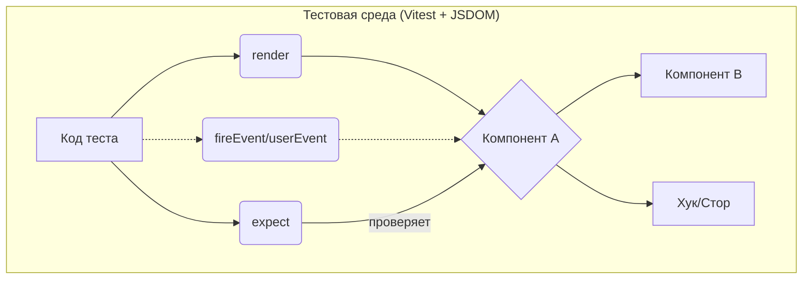

# Стратегия тестирования: E2E vs. Интеграционные тесты

## Введение

В ходе разработки мы столкнулись с задачей тестирования пользовательских сценариев. Изначально для этого использовались исключительно E2E-тесты на Playwright. Однако, после детального анализа мы пришли к выводу, что часть этих тестов можно и нужно заменить на более быстрые и надежные интеграционные тесты с использованием React Testing Library (RTL) и Vitest.

Этот документ фиксирует наше понимание этих двух видов тестов, их различия и стратегию, по которой мы принимаем решение о преобразовании E2E-теста в интеграционный.

## Определения и диаграммы

Ключевое различие между тестами — в их **масштабе** и **изоляции**.

### End-to-End (E2E) тесты

E2E-тест эмулирует полного путь пользователя через приложение в реальном браузере. В "идеальном" мире это включает и взаимодействие с реальным бэкендом.

```mermaid
graph TD
    A[Пользователь в браузере<br/>(эмулируется Playwright)] --> B{Frontend-приложение};
    B --> C[Backend API];
    C --> D[(База данных)];
    D --> C;
    C --> B;
    B --> A;
```

В нашем проекте мы используем более прагматичный подход, который можно назвать **"E2E-тесты фронтенд-приложения"**. Мы по-прежнему запускаем реальный браузер, но изолируем фронтенд от бэкенда, подменяя ответы API (мокируя их).

```mermaid
graph TD
    A[Пользователь в браузере<br/>(эмулируется Playwright)] --> B{Frontend-приложение};
    B --> C{<br>Mock API<br>(Перехватчики Playwright)<br>};
    C --> B;
    B --> A;
```

### Интеграционные тесты

Интеграционный тест проверяет, как несколько компонентов (или хуков, сторов) работают **вместе**, но делает это без запуска браузера. Вместо этого используется эмулированная среда `jsdom`, а компоненты рендерятся в виртуальный DOM.



## Сравнительная таблица

| Критерий | E2E-тесты (Playwright) | Интеграционные тесты (RTL) |
| :--- | :--- | :--- |
| **Область** | Всё приложение в сборе, включая CSS и рендеринг в браузере. | Несколько связанных компонентов и их логика. |
| **Скорость** | Медленно (секунды на тест). | Очень быстро (миллисекунды на тест). |
| **Надежность** | Низкая (часто ломаются из-за анимаций, таймингов, flaky). | Высокая (стабильны, выполняются в одной среде). |
| **Стоимость** | Высокая (сложно писать, долго отлаживать, требуют поддержки). | Низкая (легко писать и отлаживать). |
| **Уверенность** | **Высочайшая.** Дают максимальную уверенность, что всё работает для пользователя. | Высокая. Дают уверенность, что компоненты правильно работают вместе. |

## Наша стратегия: когда переписывать E2E в интеграционные?

Мы используем E2E-тесты только для проверки **самых критичных, сквозных путей пользователя**, которые невозможно или очень сложно проверить на более низком уровне.

Главный вопрос, который мы себе задаем:
> **"Проверяет ли этот тест что-то, что можно проверить, ТОЛЬКО запустив реальный браузер?"**

Если ответ "нет", то тест является кандидатом на преобразование в интеграционный.

**Примеры:**
*   Проверка сложной логики валидации формы. ➡️ **Интеграционный тест.**
*   Проверка, что после загрузки файла и ответа от (замоканного) API данные корректно отобразились в нескольких частях интерфейса. ➡️ **Интеграционный тест.**
*   Проверка, что при клике на элемент открывается модальное окно и в нем есть нужный текст. ➡️ **Интеграционный тест.**
*   Проверка, что вся страница корректно рендерится, все стили применились, и нет визуальных дефектов. ➡️ **Скриншотный тест (разновидность E2E).**
*   Проверка полного сценария: Логин -> Переход на страницу -> Загрузка файла -> Выход. ➡️ **E2E-тест.**

## Аудит существующих тестов

| E2E Тест-кейс (было) | Анализ | Решение |
| :--- | :--- | :--- |
| `TC-HP-003`: Ошибка при загрузке файла неверного формата. | Проверяет логику валидации внутри `Dropzone` и то, как ошибка отображается в `HomePage`. Не требует реального браузера. | **Преобразован в интеграционный.** |
| `TC-HP-001`: Успешная загрузка файла и отображение его имени. | Аналогично. Проверяет интеграцию компонентов `Dropzone`, `HomePage` и стора. | **Преобразован в интеграционный.** |
| `TC-HP-002`: Отправка файла на обработку и отображение хайлайтов. | Проверяет взаимодействие со стором и асинхронной логикой. Зависит от моков API. Идеальный кандидат. | **Преобразован в интеграционный.** |

Таким образом, мы оставляем E2E-тесты для самых важных сквозных сценариев, а большую часть проверок взаимодействия компонентов переносим на уровень интеграционных тестов, выигрывая в скорости и надежности. 