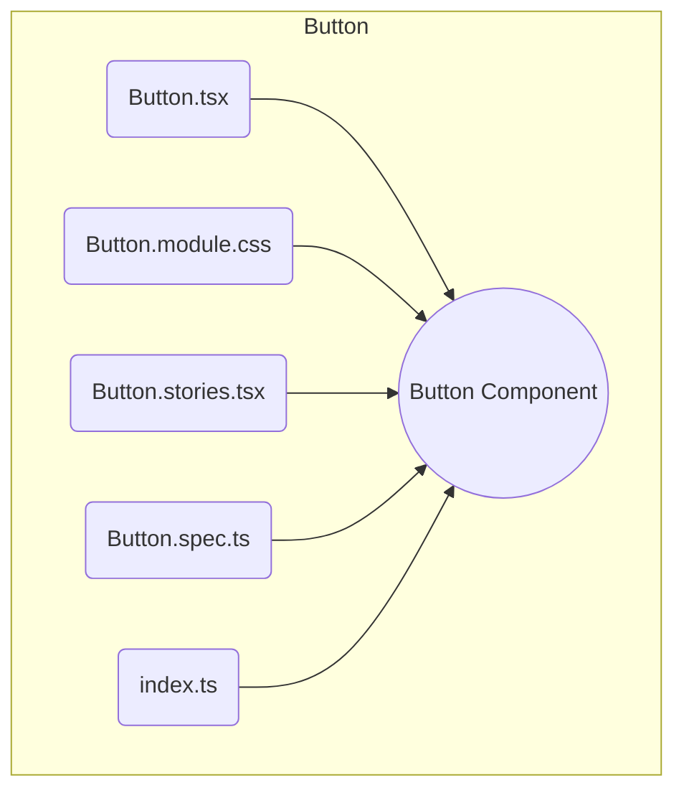

# Руководство по тестированию UI-компонентов

## Основные принципы

Тестирование UI-компонентов из пакета `@shri/ui-kit` строится на базе **Storybook** для визуализации и **Playwright** для снятия скриншотов. Наша цель — не проверять логику (она тестируется на интеграционном уровне), а гарантировать, что компонент корректно отображается во всех своих состояниях.

## Правила написания тестов и историй

Ключевой принцип — **колокация**. Все файлы, относящиеся к одному компоненту, должны лежать вместе в его директории.



1.  **Расположение файлов:**
    *   Все UI-компоненты находятся в `packages/ui-kit/src/components`.
    *   Для каждого компонента создается папка (например, `Button/`), в которой лежат:
        *   `Button.tsx` — код компонента.
        *   `Button.module.css` — стили.
        *   `Button.stories.tsx` — "истории" для Storybook.
        *   `Button.spec.ts` — скриншот-тест Playwright.
        *   `index.ts` — файл для экспорта.

2.  **Структура истории и теста:**
    *   Файлы историй и тестов содержат все необходимое для демонстрации и проверки компонента в изоляции.

## Запуск тестов

Для работы с UI-компонентами доступны следующие команды:

- `npm run storybook` - запуск Storybook в режиме разработки
- `npm run test:storybook` - запуск тестов Storybook
- `npm run test:storybook:snapshot` - запуск скриншот-тестов Storybook для проверки визуальной регрессии компонентов

Эти команды запускают соответствующие скрипты в пакете `@shri/ui-kit`. Для более подробной информации обратитесь к документации пакета (`packages/ui-kit/README.md`).

Для тестирования визуальной регрессии компонентов в основном приложении используйте:

```bash
npm run test:screenshots
```

Для интерактивной отладки:

```bash
npm run test:e2e:ui
```

## Пример

**История в Storybook:**

```tsx
// packages/ui-kit/src/components/Button/Button.stories.tsx

import type { Meta, StoryObj } from '@storybook/react';
import { Button } from './Button';

const meta = {
  title: 'UI/Button',
  component: Button,
  tags: ['autodocs'],
} satisfies Meta<typeof Button>;

export default meta;
type Story = StoryObj<typeof meta>;

export const Primary: Story = {
  args: {
    variant: 'primary',
    children: 'Primary Button',
  },
};
```

**Скриншот-тест в Playwright:**

```ts
// packages/ui-kit/src/components/Button/Button.spec.ts
import { expect, test } from '@shri/playwright';

test('Компонент Button, состояние: primary @ui-snapshot', async ({ actions, pages }) => {
  // Arrange
  await actions.storybook.openStory('ui-button--primary');

  // Act
  await expect(pages.storybook.component).toBeVisible();

  // Assert
  await expect(pages.storybook.component).toHaveScreenshot('button-primary.png');
});
``` 